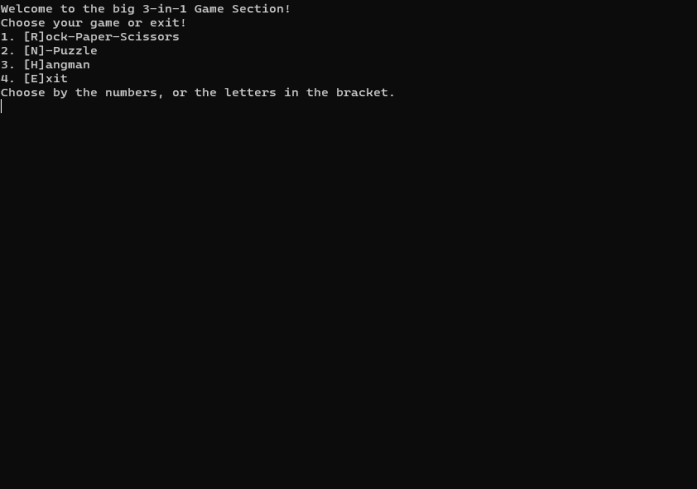

# 3-Games-in-1

Learning C# by having fun with making games/tools.
Today, I am presenting you the first version of my current project:

	- Rock Paper Scissors
	- N-Puzzle
	- Hangman

## How to run?
1. Clone repository
2. Build project with dotnet build
3. Run project with dotnet run

## Rock Paper Scissors

- Simple terminal game
- Player vs. CPU
- Player vs. Player on the same computer
- Exit 

## N-Puzzle

- Simple terminal game
- Enter a perfect square number to play the game, or not and it defaults to 9 tiles
	- 4, 9, 16, 25, etc. are perfect square numbers it accepts
- Colors to help you navigate the puzzle
- No save feature, sorry 😔
- Knuth Shuffle!
- Basic and adjusted functions for solvable game board.
	- Source: https://www.geeksforgeeks.org/check-instance-15-puzzle-solvable/
- All adapted to work with my code.

## Hangman

- simple Hangman game
- works via embedded text file
	- still no nice api backend to choose from 😔

Thanks, enjoy and can't wait for your feedback

